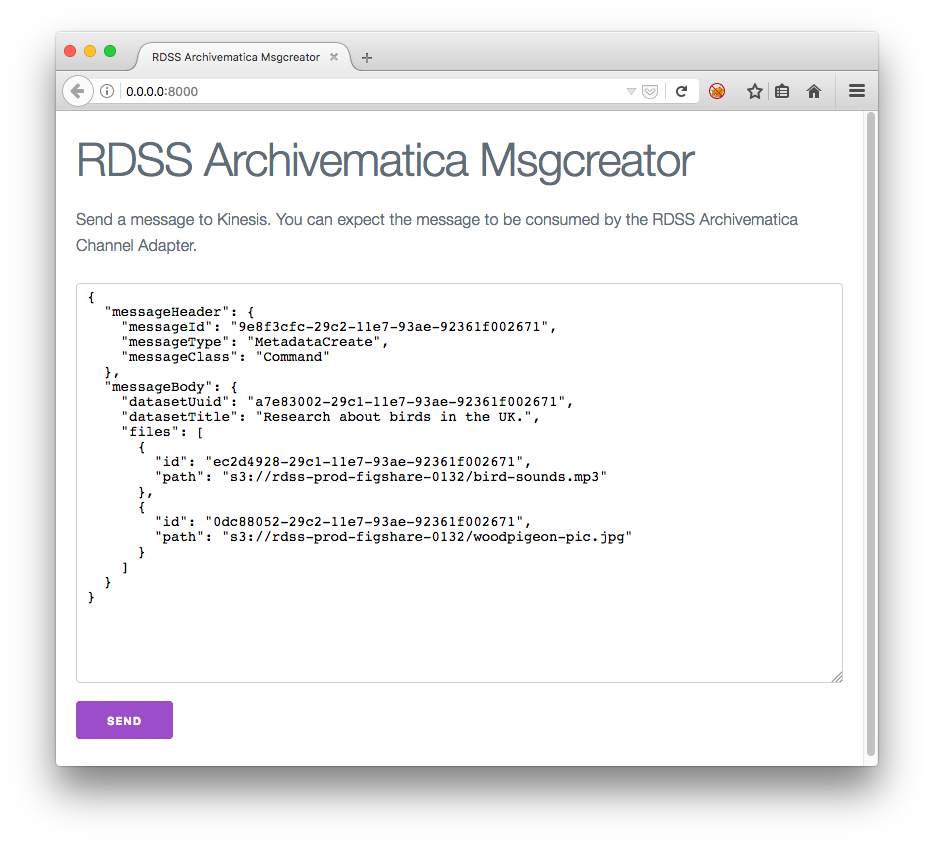

# rdss-archivematica-msgcreator

## Motivation

See https://github.com/JiscRDSS/rdss-archivematica/issues/20.

## Installation

It is already available in the Compose environment. If you still want to run it locally:

    $ go get -u github.com/JiscRDSS/rdss-archivematica-msgcreator

You can also build it with:

    $ go install ./...

## Usage example

You need a S3 server, e.g. you can use minio like in the following example:

    env \
        MINIO_ACCESS_KEY=minio \
        MINIO_SECRET_KEY=miniostorage \
            minio server \
                --address 127.0.0.1:12345 \
                    /home/foobar/s3storage

Create a new folder, e.g. `/home/foobar/s3storage/mybucket` and add some
contents to it.

Now you're ready to launch `msgcreator`, e.g.:

    rdss-archivematica-msgcreator \
        -s3-access-key=minio \
        -s3-secret-key=miniostorage \
        -s3-endpoint=http://127.0.0.1:12345 \
        -s3-region=eu-west-2 \
        -s3-default-bucket=mybucket \
        -checksums

## Screenshot

